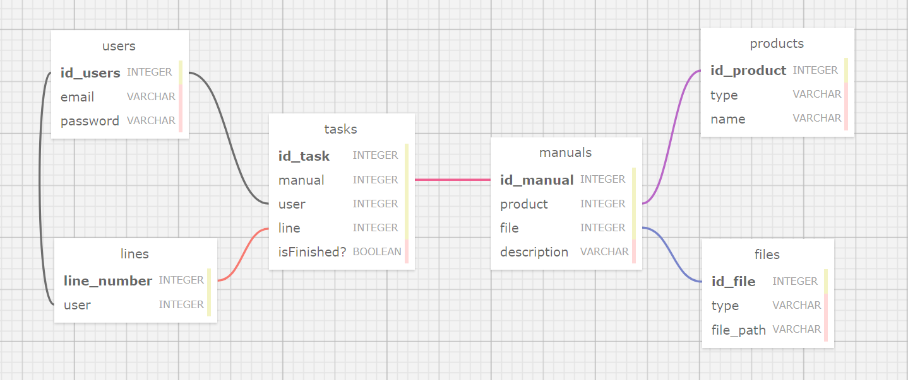

# MODELAGEM BANCO DE DADOS

Nesta atividade, foi sugerido que a modelagem relacional fosse elaborada por meio do SQL Designer, uma plataforma web que oferece uma abordagem simplificada para o desenvolvimento de esquemas de bancos de dados. O SQL Designer facilita a visualização das relações entre os diversos componentes de um Banco de Dados, permitindo uma modelagem mais clara e organizada. 
A partir disso, foi desenvolvida a seguinte modelagem de dados:

     Figura 1 
    
     Material produzido pelo autor (2024) 

 
A tabela "users" é responsável por armazenar informações dos usuários, incluindo seus nomes, emails e senhas. Esta tabela possui como chave primária o atributo "id_users", o qual está relacionado com as tabelas "lines" e "tasks". A relação entre a tabela users e lines é de N:1 enquanto a relação entre a tabela users e a tabela tasks é de 1:1, uma vez que a task, apesar de poder se repetir para mais de um usuários, é destinada individualmente para cada um, já que mantém atributos como "isFinished?" que definem a individualidade de cada task.  

A tabela "lines" é responsável por armazenar informações referentes às linhas de produção. Esta tabela possui uma chave primária denominada "line_number", que atua como identificador único para cada linha. Além disso, a tabela "lines" contém um atributo chamado "users", que funciona como uma chave estrangeira, estabelecendo uma ligação com a tabela "users". Essa relação permite associar cada linha de produção a um ou mais usuários, facilitando a gestão e atribuição de responsabilidades dentro do sistema. 

A tabela "tasks" armazena informações sobre as tarefas atribuídas a cada funcionário, mantendo atributos como "isFinished?" e "UploadTime", que garantem a individualidade das tarefas. Esta tabela possui chaves estrangeiras que a conectam com as tabelas "users" e "lines". Além disso, possui a chave primária 'id_task', que a relaciona com a tabela "manuals", com uma cardinalidade de N:1. Isso ocorre uma vez que um manual gera várias tarefas individuais que são direcionadas para diferentes usuários. 

A tabela "manuals" armazena informações sobre manuais, incluindo título e descrição, além de buscar informações nas tabelas "products" e "files" por meio das chaves estrangeiras "product" e "file", respectivamente, estabelecendo assim uma relação entre essas entidades. A cardinalidade entre as tabelas "manuals" e "products" é de 1:1, significando que um manual está associado a apenas um produto, e que um produto possui um único manual. Já a relação entre as tabelas "manuals" e "files" possui uma cardinalidade de 1:N, indicando que diversos arquivos podem estar associados a um único manual. Essas tabelas que se relacionam com a tabela manuals, possibilitando uma descrição e filtragem das características dos manuais.

